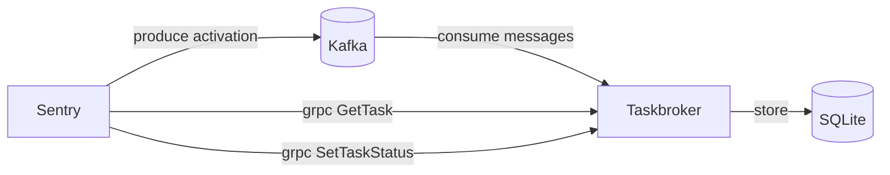

# Taskbroker

Taskbroker provides a Kafka consumer, RPC interface, and inflight task storage
that form the core engine of asynchronous task execution at sentry.

## High level overview



Sentry (and other applications in the future) produce task activations. Taskbroker
consumes those messages and stores them in a SQLite database to avoid head-of-line
blocking, competitive workers, enable out-of-order execution and per-task acknowledgements.

Workers use gRPC to fetch tasks. Once fetched, workers execute a task activation
and report execution completion via gRPC.

## Building

Taskbroker is written in Rust and requires the latest stable Rust compiler. To compile, run:

```bash
cargo build --release
```

The resulting binary ends up in `target/release/` along with debug information files.

## Development

To build `taskbroker` we require the latest stable Rust and `protoc`. The root of the repository
contains a `Makefile` with frequently run development commands:

- `make setup` Run setup tasks to create and configure your development
  environment.
- `make test` Run rust tests.
- `make integration-test` Run end to end tests.
- `make format` Format rust code with `cargo fmt` and `cargo clippy`.


## Building and Running

The simplest way to run taskbroker is with `cargo`. You'll also need
`kafka` running via [devservices](https://github.com/getsentry/devservices):

```bash
cargo run -- -c ./config/config-sentry-dev.yaml
```

## Configuration

Taskbroker uses YAML files for configuration, and all of the available
configuration options can be found in [Config](https://github.com/getsentry/taskbroker/blob/main/src/config.rs#L15)
## Tests

The test suite is composed of unit and integration tests in Rust, and end-to-end tests scripted with python.

```bash
# Run unit/integration tests
make test

# Run end-to-end tests
make integration-test
```

## Linting

We use `rustfmt` and `clippy` from the latest stable channel for code formatting and linting:

```bash
# Check for formatting issues
make style

# Fix formatting and lint issues
make format
```
