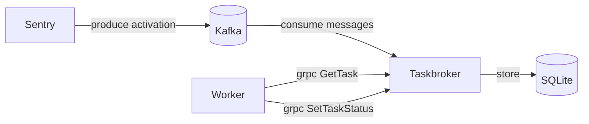

# Taskbroker

[](https://codecov.io/gh/getsentry/taskbroker)

Taskbroker provides a Kafka consumer, RPC interface, and inflight task storage
that form the core engine of asynchronous task execution at Sentry. This repository
also contains client libraries for python.

## High level overview



Sentry (and other applications in the future) produce task activations. Taskbroker
consumes those messages and stores them in a SQLite database to avoid head-of-line
blocking, enable out-of-order execution and per-task acknowledgements.

Workers communicate with Taskbroker via gRPC. There are two primary gRPC methods:

- `GetTask` Workers can request a task from Taskbroker.
- `SetTaskStatus` Once a worker has completed a task, `SetTaskStatus` is used to
  report the task's outcome.

## Building

Taskbroker is written in Rust and requires the latest stable Rust compiler. To compile, run:

```bash
cargo build --release
```

The resulting binary ends up in `target/release/` along with debug information files.

## Development

To build `taskbroker` we require the latest stable Rust and `protoc`. The root of the repository
contains a `Makefile` with frequently run development commands:

- `devenv sync` Run setup tasks to create and configure your development
  environment.
- `make unit-test` Run rust tests.
- `make integration-test` Run end to end tests.
- `make format` Format rust code with `cargo fmt` and `cargo clippy`.


## Building and Running

The simplest way to run taskbroker is with `cargo`. You'll also need
`kafka` running. Kafka is typically managed with [devservices](https://github.com/getsentry/devservices):

```bash
# Run with default config
cargo run

# Run with a specific config file
cargo run -- -c ./config/config-sentry-dev.yaml
```

## Configuration

Taskbroker uses YAML files for configuration, and all of the available
configuration options can be found in [Config](https://github.com/getsentry/taskbroker/blob/main/src/config.rs#L15)

All configuration options can also be defined as environment variables using
the `TASKBROKER_` prefix.

## Tests

The test suite is composed of unit and integration tests in Rust, and end-to-end tests scripted with python.

```bash
# Run unit/integration tests
make test

# Run end-to-end tests
make integration-test
```

## Linting

We use `rustfmt` and `clippy` from the latest stable channel for code formatting and linting:

```bash
# Check for formatting issues
make style

# Fix formatting and lint issues
make format
```

## Python Client

See the [python client README](./clients/python/README.md) for more information.

### Releasing clients

1. Use the [release client libraries workflow](https://github.com/getsentry/taskbroker/actions/workflows/release-client.yml)
2. Choose 'Run workflow' and enter a version number in.
3. This will use craft + getsentry/publish to add packages to both internal and public pypi.
